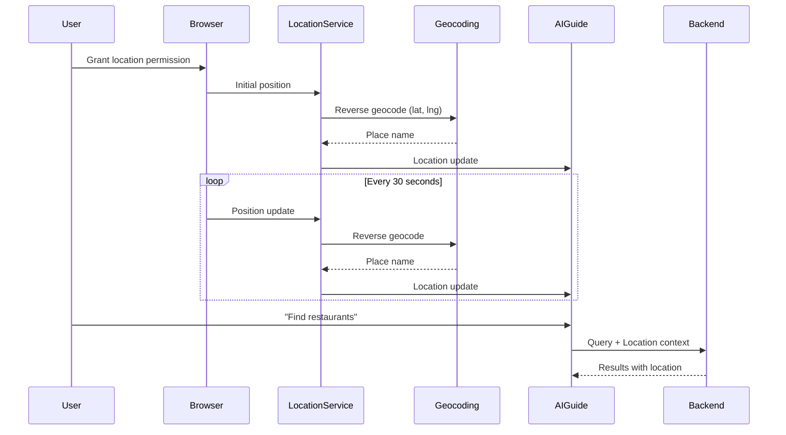

# Automatic Location Tracking System

## Overview
The application now features automatic location tracking using the browser's Geolocation API and Google Maps Geocoding for reverse geocoding. User location is periodically updated and automatically sent as context with every AI query.

## Architecture

### Components

#### 1. **Location Service** (`src/services/locationService.ts`)
Core service managing location tracking:

```typescript
class LocationService {
  // Start continuous location tracking
  startTracking(updateInterval: number): Promise<UserLocation>
  
  // Stop tracking
  stopTracking(): void
  
  // Get current location (one-time)
  getCurrentLocation(): Promise<UserLocation>
  
  // Get cached location
  getLastKnownLocation(): UserLocation | null
  
  // Subscribe to updates
  onLocationUpdate(callback: Function): () => void
}
```

**Features:**
- Singleton pattern for app-wide location state
- Automatic reverse geocoding (coordinates → place name)
- Update interval configuration
- Location caching (1-minute TTL)
- Multiple subscriber support
- High accuracy mode for initial fix

#### 2. **useLocation Hook** (`src/hooks/useLocation.ts`)
React hook for easy integration:

```typescript
const {
  location,          // Current location
  isLoading,         // Loading state
  error,             // Error state
  isTracking,        // Tracking status
  startTracking,     // Start function
  stopTracking,      // Stop function
  refreshLocation    // Manual refresh
} = useLocation({
  enableTracking: true,    // Auto-start
  updateInterval: 30000,   // 30 seconds
  onError: (err) => {...}  // Error handler
});
```

**Features:**
- Automatic subscription management
- Loading and error states
- Manual refresh capability
- Cleanup on unmount

#### 3. **AIGuide Component Updates**
Integrated automatic location tracking:

```typescript
// Auto-tracking enabled
const { location: trackedLocation, isTracking } = useLocation({
  enableTracking: true,
  updateInterval: 30000
});

// Location sent with every message
const response = await hybridRouter.routeQuery(
  input,
  destination,
  trackedLocation,  // ← Automatic location
  true
);
```

## User Interface

### Location Status Indicator
Displayed at the bottom of the AI chat:

```
┌─────────────────────────────────────────────────────┐
│ 🟢 Location: Times Square, NYC (40.7580, -73.9855) │ Stop Tracking
└─────────────────────────────────────────────────────┘
```

**States:**
- 🟢 **Tracking Active**: Shows location name and coordinates with pulsing icon
- ⚪ **Tracking Disabled**: Grayed out indicator
- 🔵 **Loading**: Shown during initial location acquisition

**Actions:**
- **Stop Tracking**: Disables continuous updates
- **Enable Tracking**: Requests permission and starts tracking

## Location Update Flow



## Configuration

### Update Intervals

```typescript
// Fast updates (more battery usage)
updateInterval: 10000  // 10 seconds

// Balanced (recommended)
updateInterval: 30000  // 30 seconds (default)

// Slow updates (battery friendly)
updateInterval: 60000  // 1 minute
```

### Geolocation Options

```typescript
// High accuracy (uses GPS, slower, more battery)
{
  enableHighAccuracy: true,
  timeout: 10000,
  maximumAge: 0
}

// Low accuracy (uses network, faster, less battery)
{
  enableHighAccuracy: false,
  timeout: 10000,
  maximumAge: 30000
}
```

## Privacy & Permissions

### Browser Permission Flow

1. **First Use**: Browser prompts for location permission
2. **Permission Granted**: Tracking starts automatically
3. **Permission Denied**: Fallback to manual location input
4. **Permission Revoked**: Tracking stops, user notified

### User Controls

- ✅ **Toggle On/Off**: Users can enable/disable tracking anytime
- ✅ **Visible Status**: Always shows current tracking state
- ✅ **Manual Override**: Can manually set location via `/location` command
- ✅ **Graceful Fallback**: Works without location if denied

## Backend Integration

### Context Format Sent to Backend

```json
{
  "message": "Find restaurants near me",
  "context": {
    "current_location": {
      "name": "Times Square, NYC",
      "lat": 40.7580,
      "lng": -73.9855,
      "accuracy": 20,
      "timestamp": 1697654400000
    }
  }
}
```

### Backend Processing

The agent receives location in `[SYSTEM CONTEXT]`:

```
User Query: Find restaurants near me

[SYSTEM CONTEXT - Use this information in your response:
User's Current Location: Times Square, NYC (coordinates: 40.7580, -73.9855)]
```

Agent automatically uses coordinates for tool calls:
```python
search_places(
  query="restaurants",
  latitude=40.7580,
  longitude=-73.9855,
  radius=5000
)
```

## Error Handling

### Permission Denied
```typescript
if (error?.message === 'Location permission denied by user') {
  // Fallback to manual input
  // Show prompt: "Enable location for better results"
}
```

### Position Unavailable
```typescript
if (error?.message === 'Location information unavailable') {
  // Use last known location
  // Or prompt for manual input
}
```

### Timeout
```typescript
if (error?.message === 'Location request timed out') {
  // Retry with higher timeout
  // Or use cached location
}
```

## Performance Optimization

### Caching Strategy
- **1-minute cache**: Prevents redundant geocoding
- **Memory storage**: Fast access to last known position
- **Conditional updates**: Only notify on significant movement

### Battery Optimization
- **Configurable intervals**: Balance accuracy vs battery
- **Network-based positioning**: Available as fallback
- **Automatic cleanup**: Stops tracking on component unmount

### Network Efficiency
- **Reverse geocoding throttling**: Max 1 request per update
- **Cached geocoding results**: Reuse for similar coordinates
- **Async processing**: Non-blocking UI updates

## Testing

### Manual Testing Steps

1. **Grant Permission**:
   ```
   Open app → Allow location when prompted
   Verify: Green indicator with location name
   ```

2. **Location Updates**:
   ```
   Wait 30 seconds → Location should update
   Move to new location → Should reflect change
   ```

3. **AI Integration**:
   ```
   Query: "Find restaurants near me"
   Verify: Agent uses current location without asking
   ```

4. **Stop/Start**:
   ```
   Click "Stop Tracking" → Indicator grays out
   Click "Enable Tracking" → Tracking resumes
   ```

### Browser Compatibility

| Browser | Geolocation API | Status |
|---------|----------------|--------|
| Chrome 90+ | ✅ Full support | Recommended |
| Firefox 88+ | ✅ Full support | Recommended |
| Safari 14+ | ✅ Full support | Recommended |
| Edge 90+ | ✅ Full support | Recommended |
| Mobile Chrome | ✅ Full support | Works great |
| Mobile Safari | ✅ Full support | Works great |

## Future Enhancements

### Planned Features

1. **Geofencing**:
   - Trigger actions when entering/leaving areas
   - "Notify me when near restaurants"

2. **Movement Detection**:
   - Detect if user is walking/driving
   - Adjust search radius accordingly

3. **Location History**:
   - Track visited places
   - "Show me places I've been"

4. **Offline Support**:
   - Cache last known location
   - Work without network for geocoding

5. **Battery Saver Mode**:
   - Reduce update frequency when battery low
   - Use network positioning only

### Advanced Use Cases

```typescript
// Geofence example
locationService.createGeofence({
  center: { lat: 40.7580, lng: -73.9855 },
  radius: 1000,
  onEnter: () => console.log('Entered Times Square!'),
  onExit: () => console.log('Left Times Square')
});

// Movement tracking
locationService.onMovement((speed, heading) => {
  if (speed > 20) {
    console.log('User is driving');
  }
});

// Location history
const history = locationService.getLocationHistory();
console.log('Places visited today:', history);
```

## Troubleshooting

### Common Issues

**Q: Location not updating?**
```
A: Check browser permissions (chrome://settings/content/location)
   Verify internet connection for geocoding
   Check console for errors
```

**Q: Accuracy too low?**
```
A: Enable high accuracy mode
   Move away from buildings (better GPS signal)
   Use WiFi for better network positioning
```

**Q: Battery draining fast?**
```
A: Increase updateInterval to 60000 (1 minute)
   Disable high accuracy mode
   Stop tracking when not needed
```

**Q: Agent still asking for location?**
```
A: Verify isTracking = true in UI
   Check context is being sent with messages
   Look for location in network requests
```

## Best Practices

### For Users
✅ Enable location for best experience
✅ Use "Stop Tracking" when not needed
✅ Check accuracy indicator
❌ Don't leave tracking on continuously
❌ Don't ignore permission prompts

### For Developers
✅ Always handle permission denials
✅ Implement fallback strategies
✅ Cache location data appropriately
✅ Clean up subscriptions
❌ Don't track without user consent
❌ Don't ignore battery concerns
❌ Don't store location without encryption

## Security Considerations

- 🔒 Location data never stored on backend
- 🔒 Sent only with user consent
- 🔒 HTTPS required for Geolocation API
- 🔒 User can disable anytime
- 🔒 No third-party tracking

## Summary

The automatic location tracking system provides:
- ✅ Seamless user experience (no manual location input)
- ✅ Real-time location updates (every 30 seconds)
- ✅ Privacy-conscious design (user control + no storage)
- ✅ Battery-efficient (configurable intervals)
- ✅ Robust error handling (graceful fallbacks)
- ✅ Easy integration (React hook + service)

Users can now ask "Find restaurants near me" and the AI will automatically use their current location without any additional prompts!
